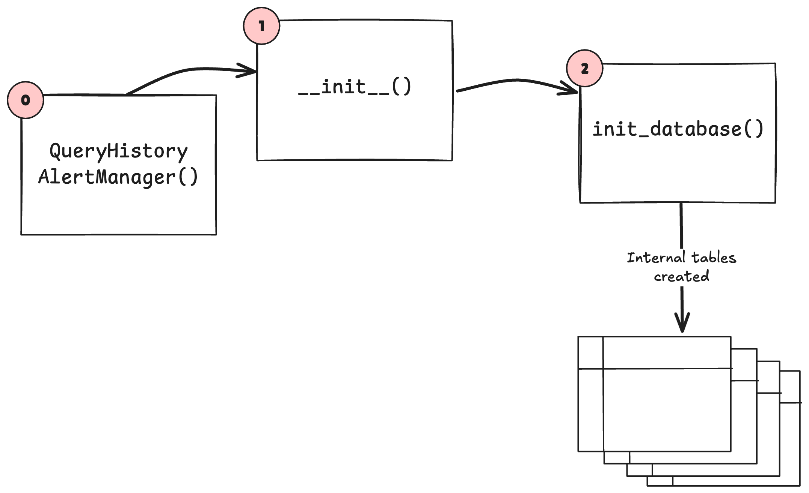
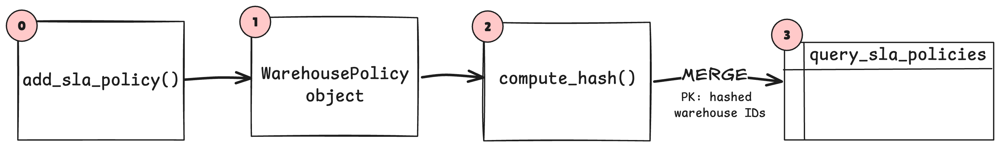

# Warehouse SLA Monitoring Framework

## Process Overview
The following sections deep-dive into the existing framework and examine the life cycle of the Query Monitoring framework from start to finish.

### Step 1: Class Instantiation
The process starts with the instantiation of the `QueryHitoryAlertManager` class (see Step 0 in the figure below):

```python
query_manager = QueryHistoryAlertManager(
   host=workspace_name, 
   dbx_token = pat_token, 
   database_name=database_name 
)
```

Then the following processes are executed behind the scenes:
| Order | Function name | Description                                                               |
| :---: | :------------ | :------------------------------------------------------------------------ |
| 0     | `QueryHistoryAlertManager()` | A `QueryHistoryAlertManager` object is created. | 
| 1     | `__init__()`  | The class constructor sets the internal params, including `workspace_url`, `internal_tables_to_manage`, and the number of Spark shuffle partitions, to name a few. |
| 2     | `initialize_database()` | Creates the parent database, if not already created, which is specified as an arg in the function call. |

 


## Step 2: SLA Policy Creation

Before the customer’s query history can be analyzed, the user needs to define a Service Level Agreement (SLA) policy, or policies. An SLA policy is created by calling the `add_sla_policy()` function on the `QueryHistoryAlertManager` object, created in Step 0 of this process. Within the call to the `add_sla_policy()` function, the user specifies the SLA threshold in seconds and a list of SQL warehouse IDs to the SLA policy should apply. 

Optionally, the user can select the mode for policy (covered in the section “Query policy modes” below) and a list of query statuses (`QUEUED`, `RUNNING`, `FAILED`, `FINISHED`) the query analyzer should filter the results by. 

**Note:** Calling the `add_sla_policy()` function is an idempotent operation.

```python
query_manager.add_sla_policy(
   warehouse_ids=["01234567890asdf;lkj"],
   sla_seconds=60,
   policy_mode="SLA_BURST",
   included_statuses=["RUNNING", "FINISHED"]
)
```
Then the following processes are executed:
| Order | Function name | Description                                                               |
| :---: | :------------ | :------------------------------------------------------------------------ |
| 0     | `add_sla_policy()` | A new SLA policy is defined or an existing one is updated by calling the `add_sla_policy()` function. | 
| 1     | `WarehousePolicy`  | An internal represenation of the SLA policy is create using a private class called `WarehousePolicy`. |
| 2     | `compute_hash()` | A hash is calculated using the SQL warehouse identifiers, which is used to make the following `MERGE` operation idempotent. |
| 3     | `MERGE` Op | The contents of the SLA policy, including the SLA time in seconds, policy mode, query statuses to filter by are `MERGED` into the `query_sla_policies` table (created during the class initialization step). |




### Query policy modes:

An SLA policy mode (`policy_mode` parameter above) specifies what events the query history analyzer should monitor the query history for, such as SLA violations or errors. There are 3 SLA policy modes:

- `SLA_BURST` - Policy Mode that triggers alerts if any query, regardless of status or success, goes above the SLA policy
- `ERROR` - Policy Mode that triggers an alert for any query that errors 
- `ALL` - Policy Mode that triggers an alert for any query that is above and SLA or errors during any point

## Step 3: Query history polling

Query SLA polling processes is started by calling th `poll_with_policy()` function and specifying the SLA policy identifier.

```python
results = (query_manager.poll_with_policy(
  policy_id=1,
  polling_frequency_seconds=30,
  hard_fail_after_n_attempts=3,
  mode='auto',
  start_over=False))
```

### Polling modes

There are 2 modes for polling the query history: `auto` and `manual`. 

- `auto` (default) - the polling state is automatically managed
- `manual` - allows the query history time frame to be overridden no matter the history
